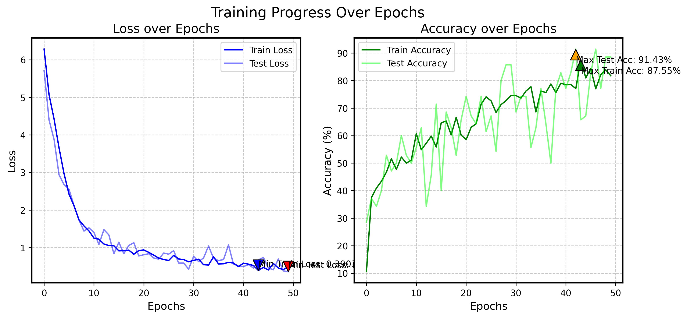
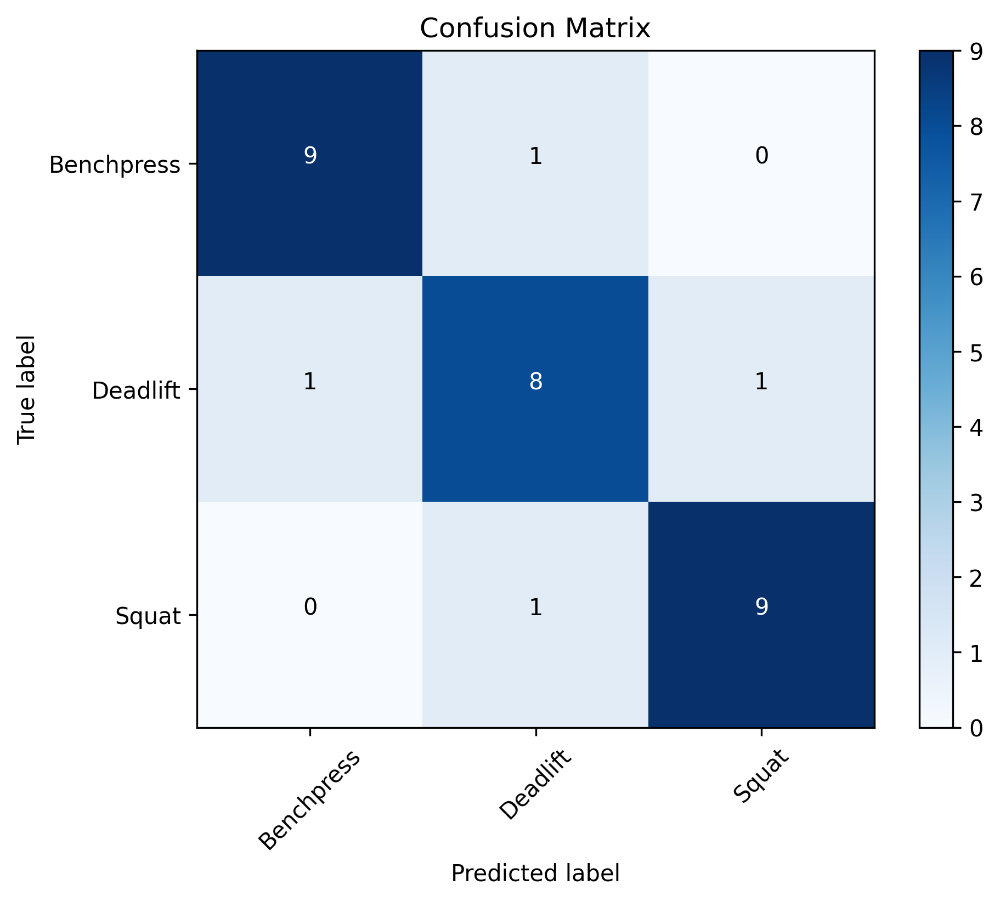

# Gym Exercise Image Classification (Benchpress, Squat, Deadlift)

## Project Description
This project aims to classify gym exercise images, specifically **Benchpress, Squat, and Deadlift**. The model used is **MobileViG**, an architecture based on **Graph Convolutional Network (GCN)** designed for image classification tasks. The implementation framework is **PyTorch**.

## Dataset
The dataset used comes from the following GitHub project:
[https://github.com/saketshirsath/cv.github.io/blob/gh-pages/CNN.ipynb](https://github.com/saketshirsath/cv.github.io/blob/gh-pages/CNN.ipynb)

Initial dataset image count:
- **Benchpress**: 154 images
- **Squat**: 195 images
- **Deadlift**: 197 images

After **data preprocessing**, each class contains **100 images**, resulting in a total dataset of **300 images**.

The dataset is then split into:
- **90% for training** (270 images)
- **10% for testing** (30 images)

## Model Architecture
The classification model used is **MobileViG**, a variant of Vision GCN with key components:
- **Grapher**: Computes relationships between nodes in a graph representation.
- **MRConv (Max Relative Graph Convolutional)**: Performs graph-based convolution operations.
- **Feed Forward Network (FFN)**: Processes extracted features to generate classification output.

The model architecture implementation is based on the paper **"MobileViG: Graph-Based Sparse Attention for Mobile Vision Applications"** and can be found in the following file:
```
model/mobilevig.py
```

## Setup and Installation
Before running the project, ensure you have installed the required dependencies by executing:
```
pip install -r requirements.txt
```

## Running the Model
1. **Ensure dependencies are installed**
2. **Run the training and testing notebook**
   ```
   sbd_classification_mobilevig.ipynb
   ```

## Python Version Used
This project uses **Python 3.10**.

## Folder Structure
```
├── dataset
│   ├── train  # Training data
│   ├── test   # Testing data
│
├── model
│   ├── mobilevig.py  # MobileViG architecture
│
├── training_results
│
├── README.md  # Project documentation
├── requirements.txt  # Dependency file
├── sbd_classification_mobilevig.ipynb  # Notebook to run training
```

## Best Experiment Results
The best experiment results were obtained using the following training scenario:
- **Batch Size**: 7
- **Model**: MobileViG-Ti
- **Optimizer**: AdamW
- **Dropout**: 0.5
- **Learning Rate**: 0.0001
- **Epoch**: 50

### Training Results
- **Training and Testing Graph**: 
- **Confusion Matrix**: 
- **Maximum Accuracy**:
  - **Train Accuracy**: 87.55%
  - **Test Accuracy**: 91.43%

### Metrics Evaluation
| Class      | Precision | Recall | F1-Score |
|------------|------------|------------|------------|
| Benchpress | 90.00% | 90.00% | 90.00% |
| Squat      | 80.00% | 80.00% | 80.00% |
| Deadlift   | 90.00% | 90.00% | 90.00% |
| **Average** | **86.67%** | **86.67%** | **86.67%** |


Thank you for reading this documentation! 🚀

